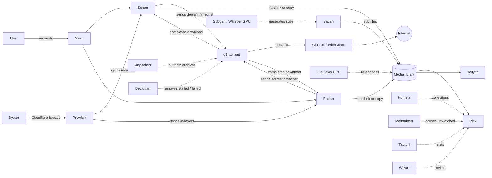

# </img>

A self-hosted media stack built on Docker Compose: Plex (and Jellyfin) as media servers, the *arr apps for automation, qBittorrent behind a WireGuard VPN kill-switch, GPU-accelerated transcoding and subtitle generation, and a set of housekeeping services that keep the whole thing running unattended.

This README is written for someone who has never seen the stack. It explains what every container does, which ones depend on which, every environment variable the compose file expects, and the exact order in which to configure the services so that each one has what it needs from the previous one.

> Forked from [DonMcD/ultimate-plex-stack](https://github.com/DonMcD/ultimate-plex-stack). The service list and the operational hardening (health checks, VPN isolation, resource limits, log rotation) diverge substantially from upstream.

---

## Table of contents

1. [How the pieces fit together](#1-how-the-pieces-fit-together)
2. [Service reference](#2-service-reference)
3. [Requirements](#3-requirements)
4. [Folder layout](#4-folder-layout)
5. [Environment variables](#5-environment-variables)
6. [First deployment](#6-first-deployment)
7. [Configuration order (step by step)](#7-configuration-order-step-by-step)
8. [Where to find every API key and token](#8-where-to-find-every-api-key-and-token)
9. [Operations: updates, health, logs](#9-operations-updates-health-logs)
10. [Troubleshooting](#10-troubleshooting)
11. [Design decisions worth knowing](#11-design-decisions-worth-knowing)

---

## 1. How the pieces fit together



The critical chain is **Seerr → Sonarr/Radarr → Prowlarr (indexers) → qBittorrent (through Gluetun) → back to Sonarr/Radarr for import → Plex**. Everything else is optional polish and can be added later.

Two hard dependencies to keep in mind:

- **qBittorrent has no network of its own.** It runs inside Gluetun's network namespace (`network_mode: service:gluetun`). If Gluetun is down, qBittorrent is unreachable and cannot leak traffic. Other containers reach qBittorrent at `http://gluetun:8080`, never at `http://qbittorrent:8080`.
- **Decluttarr and Unpackerr need Sonarr's and Radarr's API keys** in `.env`. They will crash-loop on the very first deployment until you fill those keys in and redeploy. That is expected.

---

## 2. Service reference

Ports are the host ports as published by the compose file; most are overridable through `.env` (see section 5). "Config" is the sub-folder under `${BASE_PATH}` unless stated otherwise.

### Download stack

| Service | Image | Port | What it does | Depends on |
|---|---|---|---|---|
| **gluetun** (container `vpn`) | `qmcgaw/gluetun` (pinned) | 8080 (published *for* qBittorrent) | WireGuard VPN client with a built-in firewall (kill-switch). Only traffic through the tunnel is allowed out. Also publishes qBittorrent's WebUI port on its behalf. | Mullvad WireGuard key |
| **qbittorrent** | `linuxserver/qbittorrent` | via gluetun:8080 | The BitTorrent client. All its traffic goes through Gluetun. | gluetun healthy |
| **prowlarr** | `linuxserver/prowlarr` | 9696 | Indexer manager. You add torrent indexers once here and Prowlarr pushes them to Sonarr and Radarr. | byparr (optional) |
| **byparr** | `ghcr.io/thephaseless/byparr` | 8191 | FlareSolverr-compatible proxy that solves Cloudflare challenges for indexers that need it. | — |
| **unpackerr** | `golift/unpackerr` | — | Watches completed downloads and extracts `.rar`/`.zip` so Sonarr/Radarr can import them. | Sonarr + Radarr API keys |
| **decluttarr** | `ghcr.io/manimatter/decluttarr` | — | Removes stalled, slow, metadata-less and failed downloads from qBittorrent and tells Sonarr/Radarr to look for another release. | Sonarr, Radarr, qBittorrent credentials |

### Media management

| Service | Image | Port | What it does | Depends on |
|---|---|---|---|---|
| **sonarr** | `linuxserver/sonarr` | 8989 | TV series automation: monitors series, grabs releases, renames and imports. | prowlarr, qbittorrent |
| **radarr** | `linuxserver/radarr` | 7878 | Same for movies. | prowlarr, qbittorrent |
| **seerr** | `ghcr.io/seerr-team/seerr` | 5055 | Request portal for your users (successor of Overseerr). Users log in with Plex, request titles, Seerr forwards them to Sonarr/Radarr and reports availability. Config lives in `${BASE_PATH}/overseerr`. | plex, sonarr, radarr |
| **bazarr** | `linuxserver/bazarr` | 6767 | Subtitle automation for everything Sonarr and Radarr manage. | sonarr, radarr |
| **subgen** | `mccloud/subgen` | 8580 (UI), 9000 (internal webhook) | Whisper speech-to-text on the NVIDIA GPU. Bazarr uses it as a subtitle provider when no subtitle exists online. | NVIDIA GPU, bazarr |
| **bookshelf** | `ghcr.io/pennydreadful/bookshelf:hardcover` | 8787 | Readarr fork with Hardcover metadata: automation for books and audiobooks. | prowlarr, qbittorrent |
| **audiobookshelf** | `ghcr.io/advplyr/audiobookshelf` | 13378 | Audiobook and podcast server with its own apps. Reads `${MEDIA_SHARE}/audiobooks` and `/podcasts`. | — |
| **ytdl-sub** | `ghcr.io/jmbannon/ytdl-sub` | — | Subscribes to YouTube channels/playlists and downloads them into a Plex-friendly layout every 6 h. Headless; configured with YAML under `${BASE_PATH}/ytdl-sub`. | — |

### Media servers and Plex companions

| Service | Image | Port | What it does | Depends on |
|---|---|---|---|---|
| **plex** | `linuxserver/plex` | 32400 (host network) | The media server. NVIDIA hardware transcoding. Config and transcode dir on the fast disk (`${FAST_MOUNT}`). | NVIDIA GPU |
| **jellyfin** | `jellyfin/jellyfin` | 8096 | Second media server, read-only on the same library. Optional. | NVIDIA GPU |
| **tautulli** | `ghcr.io/tautulli/tautulli` | 8181 | Plex playback statistics and notifications. | plex |
| **wizarr** | `ghcr.io/wizarrrr/wizarr` | 5690 | Generates invite links so friends can join your Plex without you sharing manually. | plex |
| **kometa** | `kometateam/kometa` | — | Builds Plex collections, posters and metadata from YAML. Runs once a day at 03:00. Config in `${BASE_PATH}/kometa/config.yml`. | plex |
| **maintainerr** | `ghcr.io/jorenn92/maintainerr` | 6246 | Rules engine that removes media nobody watched after N days, coordinating Plex, Seerr, Sonarr and Radarr. | plex, seerr, sonarr, radarr |
| **fileflows** | `revenz/fileflows` | 19200 | Media processing flows (re-encode to H.264/AAC for direct play, strip tracks, etc.) using NVENC. Temp and logs on `${FAST_MOUNT}`. | NVIDIA GPU |

### Housekeeping

| Service | Image | Port | What it does |
|---|---|---|---|
| **watchtower** | `containrrr/watchtower` | 8081 (metrics) | Pulls new images on a schedule and recreates containers. Gluetun and qBittorrent are **excluded** (label) and updated by hand, see section 9. |
| **autoheal** | `willfarrell/autoheal` | — | Restarts any container whose health check turns `unhealthy`. This is what recovers qBittorrent if it comes up before the VPN tunnel exists. |
| **flame** | `pawelmalak/flame` | 1313 | Start page. Reads the `flame.*` labels on every container and builds the dashboard automatically. |

---

## 3. Requirements

- Linux host with Docker Engine 24+ and the Compose v2 plugin (`docker compose version`).
- An **NVIDIA GPU** with the driver installed on the host and the [NVIDIA Container Toolkit](https://docs.nvidia.com/datacenter/cloud-native/container-toolkit/latest/install-guide.html) configured (`nvidia-smi` must work inside a test container). Plex, Jellyfin, Subgen and FileFlows request the GPU with `deploy.resources.reservations.devices`. If you have no GPU, delete those blocks and the `NVIDIA_*` variables, and switch Subgen to `TRANSCRIBE_DEVICE=cpu`.
- `/dev/net/tun` on the host (loaded `tun` kernel module) for Gluetun. Inside an LXC container this must be passed through explicitly.
- A **Mullvad** account (or another WireGuard provider supported by Gluetun; see section 11 about port forwarding).
- A Plex account and a claim token.
- Roughly 3 GB of RAM headroom for the stack, plus whatever Plex transcoding needs. Memory limits are set per service in the compose file.
- Optional: Portainer. The stack is deployed as a Portainer Git stack in the reference setup, but plain `docker compose` works identically.

---

## 4. Folder layout

The compose file expects four host locations, all supplied through `.env`:

```
${BASE_PATH}/                # app configs (small, many writes) -> put on SSD/NVMe
├── sonarr/  radarr/  prowlarr/  bazarr/  qbittorrent/  overseerr/  ...

${FAST_MOUNT}/               # scratch space for GPU jobs and Plex -> NVMe
├── plex/config/  plex/transcode/
├── fileflows/temp/  fileflows/logs/
├── jellyfin/cache/
└── subgen/transcribe/

${DOWNLOAD_DIR}/             # qBittorrent completed downloads -> same filesystem as MEDIA_SHARE if you want hardlinks
├── complete/tv/
├── complete/movies/
└── complete/tv-packs/

${INCOMPLETE_DOWNLOAD_DIR}/  # qBittorrent in-progress downloads (temp path)

${MEDIA_SHARE}/              # the library Plex/Jellyfin read -> big HDD pool
├── tv/  movies/  youtube/  cine/  music/  audiobooks/  podcasts/  system/
```

Inside the containers the paths are always the same, regardless of the host:

| Host variable | Mounted as | In which containers |
|---|---|---|
| `${MEDIA_SHARE}` | `/media` | sonarr, radarr, bazarr, bookshelf |
| `${MEDIA_SHARE}/tv`, `/movies` | `/tv`, `/movies` | plex, jellyfin, subgen |
| `${MEDIA_SHARE}` | `/library` | fileflows |
| `${DOWNLOAD_DIR}` | `/downloads` | qbittorrent, sonarr, radarr, unpackerr, bookshelf |
| `${INCOMPLETE_DOWNLOAD_DIR}` | `/incomplete` | qbittorrent |

**Consequence for Sonarr/Radarr:** the download client path is `/downloads/complete/<category>` and the root folders are `/media/tv` and `/media/movies`. Use exactly those strings when configuring them (section 7). Never point Sonarr at a host path.

**About hardlinks:** Sonarr and Radarr can hardlink an import instead of copying it only if `/downloads` and `/media` live on the same filesystem *and* are reachable under the same mount inside the container. With the current two-mount layout (and with MergerFS pools that spread files across disks) imports are **copies**. It works, it just costs disk space and time. Moving to a single `/data` mount is on the roadmap; the [TRaSH guide on hardlinks](https://trash-guides.info/File-and-Folder-Structure/Hardlinks-and-Instant-Moves/) explains the target layout.

Create the folders before the first `up`, owned by the `PUID:PGID` user:

```bash
sudo mkdir -p "$BASE_PATH" "$FAST_MOUNT" "$DOWNLOAD_DIR"/complete/{tv,movies} "$INCOMPLETE_DOWNLOAD_DIR" \
              "$MEDIA_SHARE"/{tv,movies,youtube,cine,music,audiobooks,podcasts,system}
sudo chown -R "$PUID:$PGID" "$BASE_PATH" "$FAST_MOUNT" "$DOWNLOAD_DIR" "$INCOMPLETE_DOWNLOAD_DIR" "$MEDIA_SHARE"
```

---

## 5. Environment variables

Copy `.env.example` to `.env` next to `docker-compose.yml` (or paste the variables into Portainer's stack environment). Compose reads `.env` automatically.

### Required (the stack will not start without them)

| Variable | Example | Used by | Notes |
|---|---|---|---|
| `PUID` / `PGID` | `1000` / `1000` | almost everything | Numeric user/group that owns the media and config folders. Find yours with `id`. |
| `TZ` | `Europe/Madrid` | everything | Olson timezone. Schedules (Kometa 03:00, watchtower) use it. |
| `HOST_IP` | `192.168.1.10` | flame labels | LAN IP of the Docker host. Only used to build dashboard links. |
| `BASE_PATH` | `/srv/appdata` | all configs | App data. |
| `FAST_MOUNT` | `/srv/fast` | plex, jellyfin, fileflows, subgen | Fast scratch disk. |
| `MEDIA_SHARE` | `/srv/pool/media` | servers, *arr | The library. |
| `DOWNLOAD_DIR` | `/srv/pool/downloads` | qbittorrent, *arr, unpackerr | Completed downloads. |
| `INCOMPLETE_DOWNLOAD_DIR` | `/mnt/incomplete` | qbittorrent | In-progress downloads. |
| `WIREGUARD_PRIVATE_KEY` | `wOEI9rqq...=` | gluetun | From your Mullvad WireGuard config (section 8). |
| `WIREGUARD_ADDRESSES` | `10.64.0.2/32` | gluetun | The `Address` line of the same config. |
| `SERVER_COUNTRIES` | `Netherlands,Switzerland,Sweden` | gluetun | Comma-separated. Gluetun picks a server among them. |
| `PLEX_CLAIM` | `claim-xxxxxxxx` | plex | Only needed on the very first start; expires in 4 minutes. |

### Required after first configuration (second deploy)

| Variable | Used by | Notes |
|---|---|---|
| `SONARR_KEY` | decluttarr, unpackerr | Sonarr → Settings → General → API Key. |
| `RADARR_KEY` | decluttarr, unpackerr | Radarr → Settings → General → API Key. |
| `QBITTORRENT_USERNAME` | decluttarr | qBittorrent WebUI user (default `admin`). |
| `QBIT_PASS` | decluttarr | The password you set in qBittorrent's WebUI. |

### Optional (defaults in parentheses)

| Variable | Default | Notes |
|---|---|---|
| `CONFIG_DIR` | `./config` | Only Gluetun's state dir. Set it to `${BASE_PATH}` to keep everything together. |
| `QBIT_PORT` | `8080` | Published on the Gluetun container. |
| `PROWLARR_PORT`, `SONARR_PORT`, `RADARR_PORT`, `BAZARR_PORT`, `OVERSEERR_PORT`, `TAUTULLI_PORT`, `WIZARR_PORT`, `JELLYFIN_PORT`, `FILEFLOWS_PORT`, `MAINTAINERR_PORT`, `MAINTAINERR_API_PORT`, `FLARESOLVERR_PORT`, `WATCHTOWER_PORT`, `UNPACKERR_PORT` | `9696`, `8989`, `7878`, `6767`, `5055`, `8181`, `5690`, `8096`, `19200`, `6246`, `3001`, `8191`, `8081`, `5656` | Host ports. Change only on conflicts. |
| `FLAME_PORT` | `1313` | Host port for the dashboard. |
| `FLAME_PASSWORD` | `flame` | Dashboard edit password. Change it. |
| `WATCHTOWER_SCHEDULE` | `0 3 0 * * 6` | 6-field cron (with seconds): Saturdays 00:03. |
| `WATCHTOWER_NOTIFICATION_URL` | empty | [shoutrrr](https://containrrr.dev/shoutrrr/) URL, e.g. `ntfy://ntfy.sh/mytopic`. |

Ports that are fixed in the compose file (not variables): audiobookshelf `13378`, bookshelf `8787`, subgen `8580`, Jellyfin discovery `7359/udp` and `1900/udp`, Plex `32400` (host network).

---

## 6. First deployment

```bash
git clone https://github.com/asophila/ultimate-plex-stack.git
cd ultimate-plex-stack
cp .env.example .env
$EDITOR .env                 # fill in everything under "Required"
docker compose config -q     # validates the file and your variables; must print nothing
docker compose up -d
docker compose ps            # wait until gluetun and qbittorrent show (healthy)
```

With Portainer: *Stacks → Add stack → Repository*, point it at this repo, paste the variables in the *Environment variables* section, deploy. Redeploying later is *Stacks → your stack → Pull and redeploy*.

Expected state after the first `up`:

- `decluttarr` and `unpackerr` exit or restart in a loop because `SONARR_KEY`/`RADARR_KEY` are empty. Ignore them until step 4 below.
- `qbittorrent` may show `unhealthy` for up to 3 minutes while Gluetun connects; autoheal restarts it if it came up too early. If it stays unhealthy, see Troubleshooting.
- Everything else should be `healthy` or `running` within a couple of minutes.

---

## 7. Configuration order (step by step)

Do these in order. Each step produces something the next one needs.

### Step 1: verify the VPN

```bash
docker exec vpn wget -qO- https://am.i.mullvad.net/connected
```

It must say you are connected through Mullvad. If Gluetun keeps restarting, the WireGuard key or address is wrong.

### Step 2: qBittorrent (`http://HOST_IP:8080`)

1. Get the temporary password: `docker logs qbittorrent 2>&1 | grep -i password`. Log in as `admin`.
2. *Settings → WebUI*: set a permanent password. Put the same value in `.env` as `QBIT_PASS`. Tick *Bypass authentication for clients on localhost* (the container health check needs it) and add your LAN subnet to *Bypass authentication for clients in whitelisted IP subnets* if you want scripts to call the API without a session.
3. *Settings → Downloads*: default save path `/downloads/complete`, keep incomplete torrents in `/incomplete`.
4. *Settings → Advanced → Network interface*: select **`tun0`**. This binds libtorrent to the VPN interface. Without it, if qBittorrent ever starts before the tunnel exists, it silently binds to the Docker interface and every tracker returns *Operation not permitted*.
5. *Settings → BitTorrent*: seeding limits to taste. The stack has no port forwarding (Mullvad dropped it in 2023), so leave the listening port as is; incoming connections will not work anyway.
6. Categories are created automatically by Sonarr/Radarr in the next steps (`tv`, `movies`). Optionally create `tv-packs` for multi-season packs imported by hand.

### Step 3: Prowlarr (`http://HOST_IP:9696`)

1. Set authentication on the first screen.
2. *Settings → Indexers → Indexer Proxies → +*: type FlareSolverr, host `http://byparr:8191`, tag `cloudflare`. Assign the tag to indexers that need it.
3. *Indexers → +*: add your indexers. For each one, in *Torrent Base Settings*, set **Minimum Seeders = 5**; public indexers report fake seed counts and this filters most dead releases.
4. Leave *Settings → Apps* empty for now; it needs Sonarr's and Radarr's API keys (step 4).

### Step 4: Sonarr (`8989`) and Radarr (`7878`)

For each of them:

1. *Settings → Media Management*: enable *Rename*, add root folder `/media/tv` (Sonarr) or `/media/movies` (Radarr). Enable *Use Hardlinks instead of Copy* (harmless when hardlinks are impossible).
2. *Settings → Download Clients → +* → qBittorrent: host **`gluetun`**, port `8080`, username `admin`, password the one from step 2, category `tv` (Sonarr) / `movies` (Radarr). *Remove completed* on. Test, save.
3. *Settings → Download Clients → Remote Path Mappings*: none needed; both containers see `/downloads` at the same path.
4. *Settings → General → Security*: copy the **API Key**. Put it in `.env` as `SONARR_KEY` / `RADARR_KEY`.
5. *Settings → Profiles*: pick your quality profile. Custom Formats worth adding from day one: a negative score for releases whose title contains `Audio Description|DVS` (audio-described tracks for the visually impaired end up as the only audio) and for `\b(dub|dubbed)\b` if you want original language.

Back in **Prowlarr → Settings → Apps → +**: add Sonarr (`http://sonarr:8989`, its API key) and Radarr (`http://radarr:7878`, its API key). Prowlarr pushes all indexers to both and keeps them in sync.

Now **redeploy** (`docker compose up -d` or *Pull and redeploy* in Portainer) so Decluttarr and Unpackerr pick up the keys. Check `docker logs decluttarr`: it must print `OK` for qBittorrent, Sonarr and Radarr.

### Step 5: Plex (`http://HOST_IP:32400/web`)

1. The claim token in `.env` links the server to your account on the first start. If it expired, get a fresh one at <https://plex.tv/claim>, put it in `.env` and recreate the container (`docker compose up -d --force-recreate plex`).
2. Add libraries: TV → `/tv`, Movies → `/movies`, optionally `/youtube` and `/cine`.
3. *Settings → Transcoder*: enable hardware acceleration (needs Plex Pass) and set the temp directory to `/transcode`.
4. Grab your **Plex token** for the companions (section 8).

### Step 6: Seerr (`http://HOST_IP:5055`)

The setup wizard walks you through it: sign in with Plex → select this server and the libraries to sync → add Radarr (`http://radarr:7878`, API key, root folder `/media/movies`, a quality profile, tick *Default server*) → add Sonarr (`http://sonarr:8989`, API key, root folder `/media/tv`, profile, *Default server*, and optionally a separate anime profile). Then *Settings → Users* to decide who may request what.

### Step 7: Bazarr (`6767`) and Subgen

1. Bazarr *Settings → Sonarr*: `http://sonarr:8989` + API key. Same for Radarr. Path mappings are not needed (Bazarr also sees `/media`).
2. *Settings → Languages*: create a profile with the languages you want and set it as default for series and movies.
3. *Settings → Providers*: add your subtitle providers. Add **Whisper** with endpoint `http://subgen:9000`, timeout 3600, so Subgen transcribes on the GPU when nothing is found online.
4. Recommended: *Settings → Subtitles → Minimum score* series 80, and disable *Use subsync threshold* so every downloaded subtitle gets synced.

### Step 8: Plex companions

- **Tautulli** (`8181`): the wizard asks you to sign in with Plex and picks the server. Nothing else required.
- **Wizarr** (`5690`): create the admin, then connect the Plex server with its URL (`http://HOST_IP:32400`) and token.
- **Kometa**: create `${BASE_PATH}/kometa/config.yml` from the [Kometa template](https://kometa.wiki/en/latest/config/overview/) with Plex URL `http://HOST_IP:32400`, Plex token, a TMDb API key and the collection files you want. It runs at 03:00; to test immediately: `docker exec kometa python kometa.py --run`.
- **Maintainerr** (`6246`): *Settings*: Plex URL + token, Seerr URL `http://seerr:5055` + its API key, Radarr/Sonarr URLs + keys. Then create rules (e.g. "movies requested more than 90 days ago and never watched → remove").

### Step 9: FileFlows (`19200`)

Add a library pointing at `/library` (or `/library/tv` and `/library/movies` separately), a processing node with the NVIDIA GPU, and a flow. The reference flow re-encodes to H.264 NVENC + AAC/AC3 with `faststart` for direct play; the original is replaced, so Sonarr will log an *episode file deleted* event followed by a re-detection. That is normal.

### Step 10: Books, audiobooks, YouTube (optional)

- **Bookshelf** (`8787`): configured like Sonarr (download client `gluetun:8080`, category `books`, root folder under `/media`). Add it as an app in Prowlarr.
- **Audiobookshelf** (`13378`): create the admin, add libraries `/audiobooks` and `/podcasts`.
- **ytdl-sub**: write `${BASE_PATH}/ytdl-sub/subscriptions.yaml` following the [ytdl-sub docs](https://ytdl-sub.readthedocs.io/). Output goes to `/tv_shows` (`${MEDIA_SHARE}/youtube`), which you can add to Plex as a TV library.

### Step 11: Flame (`1313`)

Open it, enter `FLAME_PASSWORD`, *Settings → Docker → Use Docker API* on. Every container carrying `flame.*` labels appears automatically.

---

## 8. Where to find every API key and token

| What | Where |
|---|---|
| Mullvad WireGuard key and address | mullvad.net → *Account* → *WireGuard configuration* → generate for Linux → open the `.conf`: `PrivateKey` → `WIREGUARD_PRIVATE_KEY`, `Address` → `WIREGUARD_ADDRESSES` (keep the `/32`). |
| Plex claim token | <https://plex.tv/claim> while signed in. Valid 4 minutes. |
| Plex token | Sign in to the web app, open any item → *Get Info* → *View XML*, the URL ends in `X-Plex-Token=...`. Or read `PlexOnlineToken` from `${FAST_MOUNT}/plex/config/Library/Application Support/Plex Media Server/Preferences.xml`. |
| Sonarr / Radarr / Prowlarr / Bookshelf API key | *Settings → General → Security → API Key* (also in `config.xml` inside each config folder). |
| Bazarr API key | *Settings → General → Security*. |
| Seerr API key | *Settings → General → API Key*. |
| qBittorrent temporary password | `docker logs qbittorrent 2>&1 \| grep -i password` on first start. |
| Tautulli API key | *Settings → Web Interface → API*. |
| TMDb API key (Kometa) | themoviedb.org → account → *API*. |

---

## 9. Operations: updates, health, logs

**Updates.** Watchtower updates every container on `WATCHTOWER_SCHEDULE` except Gluetun and qBittorrent, which carry `com.centurylinklabs.watchtower.enable=false`. Reason: Watchtower recreates linked containers without waiting for health, and qBittorrent starting before the tunnel exists silently kills all downloads. Update those two by hand, in order:

```bash
docker compose pull gluetun qbittorrent
docker compose up -d gluetun          # wait for (healthy)
docker compose up -d qbittorrent
```

Gluetun's image tag is pinned on purpose; bump it deliberately after reading its release notes.

**Health.** Every service has a health check. `docker compose ps` shows them. Autoheal restarts anything `unhealthy` after a 10-minute grace period at startup. qBittorrent's check is stricter than a ping: it requires libtorrent to report DHT nodes, which proves the client is actually bound to the VPN interface.

**Logs.** All containers rotate logs (10 MB × 2 files). `docker compose logs -f --tail 100 <service>` is the fastest way to look at one of them.

**Backups.** Everything that matters is under `${BASE_PATH}` (app databases and settings) plus `.env`. Media and downloads are reproducible. Snapshot or rsync `${BASE_PATH}` regularly; the *arr apps also keep their own backups under `<app>/Backups`.

---

## 10. Troubleshooting

**qBittorrent shows 0 B/s on everything, DHT 0 nodes, trackers say *Operation not permitted*.**
It started before Gluetun had `tun0` up and bound to the wrong interface. Fix: `docker compose restart qbittorrent`. Prevent: step 2.4 (interface `tun0`) plus the health check, which makes autoheal do the restart for you within a few minutes.

**qBittorrent WebUI freezes, container unhealthy, high CPU on a child process.**
The container was created without the `ulimits` block (for example by an older compose file). qBittorrent inherits a file-descriptor limit of 2^30 and any subprocess spawn loops for minutes ([qBittorrent #23453](https://github.com/qbittorrent/qBittorrent/issues/23453)). Make sure the `ulimits: nofile:` block is present and recreate the container.

**Decluttarr or Unpackerr keep restarting.**
`SONARR_KEY` / `RADARR_KEY` / `QBIT_PASS` missing or wrong in `.env`. Decluttarr also fails once at startup if it comes up before Gluetun (it cannot resolve `gluetun`); it exits and restarts by itself.

**Sonarr/Radarr say the download client is unreachable.**
The host must be `gluetun` (the service name), not `qbittorrent` and not `vpn`. Port `8080`.

**Downloads finish but never import.**
Check *Activity → Queue* in Sonarr/Radarr for the reason. Common ones: the release was a fake (`.exe`/`.scr` inside), a season pack spanning several seasons (Sonarr cannot import those automatically), or a *not an upgrade* rejection. Decluttarr cleans the first and last cases; multi-season packs need manual import.

**Old or rare titles sit at 0% for hours.**
Expected with a VPN without port forwarding: you can only connect to seeders that are not themselves behind NAT. Decluttarr waits 24 h for stalled downloads and 6 h for magnets that never fetch metadata before removing them and asking for another release. Tag a torrent `Don't Kill` in qBittorrent to exempt it.

**Everything got recreated after a redeploy and in-progress downloads disappeared.**
Recreating the qBittorrent container drops torrents whose data was in `/incomplete` if that path was not mounted at the time. `INCOMPLETE_DOWNLOAD_DIR` must be a real host directory.

**Plex cannot see the GPU.**
`docker exec plex nvidia-smi` must work. If not, the NVIDIA Container Toolkit is not configured for the Docker daemon (`nvidia-ctk runtime configure --runtime=docker`, then restart Docker).

---

## 11. Design decisions worth knowing

- **Gluetun as the only way out.** qBittorrent shares Gluetun's network namespace and Gluetun's firewall drops anything not going through the tunnel. There is no scenario where torrent traffic uses the host's IP. `FIREWALL_OUTBOUND_SUBNETS` allows LAN and Docker-network traffic so Sonarr/Radarr can talk to the client.
- **No port forwarding.** Mullvad removed it in July 2023. Gluetun supports port forwarding natively with ProtonVPN, Private Internet Access, Perfect Privacy and PrivateVPN. Switching provider is a two-line change (`VPN_SERVICE_PROVIDER`, `VPN_PORT_FORWARDING=on`) and is the single biggest improvement available for rare content.
- **Public indexers and fakes.** Fake releases (a `.exe` named like an episode, always the same few sizes) are common on public indexers. Minimum Seeders = 5 in Prowlarr, a release profile that rejects `.exe`/`.scr`, and Decluttarr's failed-download cleanup keep them out of the library. A malware scanner on the download folder is a good addition.
- **Decluttarr's `REMOVE_ORPHANS` is off.** It once removed four healthy in-progress downloads during a transient Sonarr API hiccup. The other jobs are kept with generous strike counts.
- **Watchtower excludes the VPN pair.** See section 9.
- **Everything has memory limits and log rotation.** A misbehaving container cannot take the host down or fill the disk with logs.
- **Portainer overwrites the compose file on disk.** If you deploy through Portainer, this Git repository is the source of truth; edits made directly on the server are lost on the next redeploy.

---

## License

MIT, as upstream. See [LICENSE](LICENSE).
